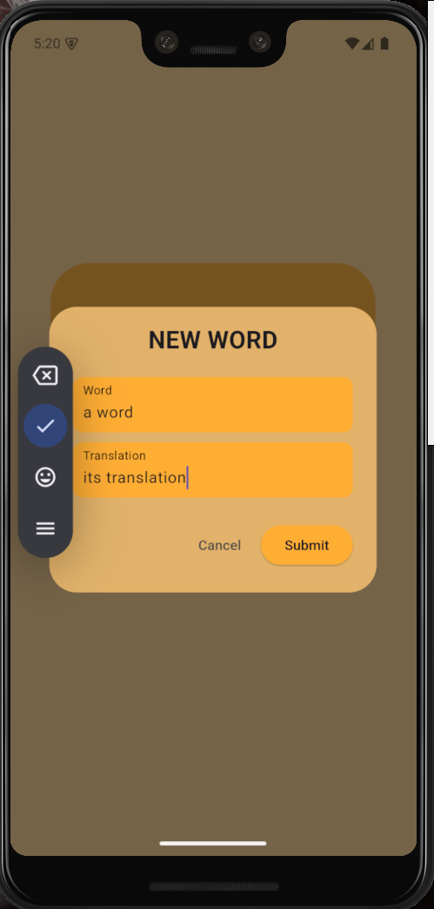
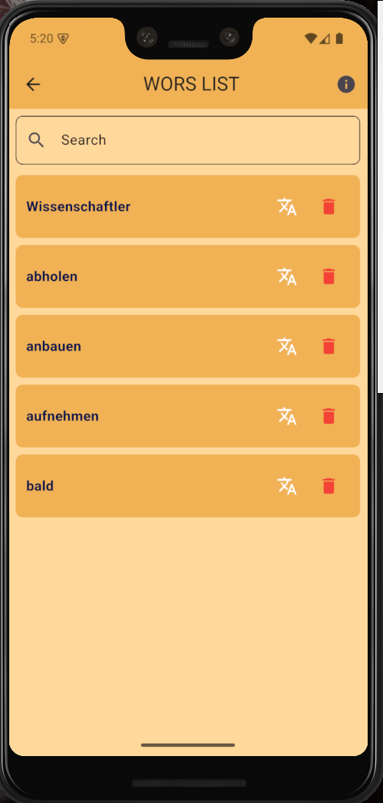
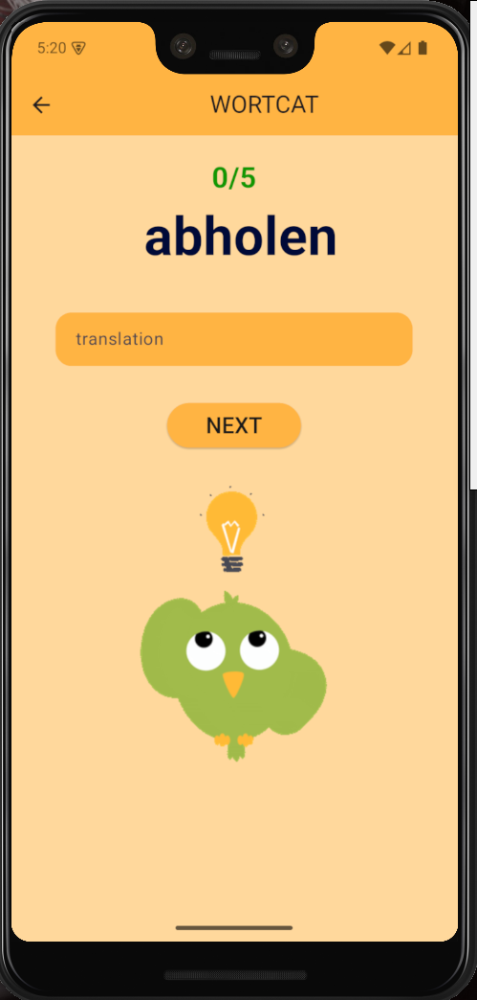

# WORTCAT

## 📌 Overview
Wortcat is a **cross-platform** app that helps you with improving you vocabulary in a language you are learning by allowing you to store words and their translations in a list that will be stored in your phone and then you can play game guessing the translation of 20 words from the list this method helped me a lot so i turned it into an app.

## ✨ Features
**✅ Add words**
**✅ check your words list**
**✅ play a guessing game**
**✅ Simple and user-friendly interface.**

## 🛠️ Technologies Used
- **Flutter (Dart)**
- **Local storage** offline access. **hive**

## 🚀 Installation
-**using terminal:**
```bash
# Clone the repository
git clone https://github.com/yourusername/wortcat.git

# Navigate to the project directory
cd LockSmith

# Install dependencies
flutter pub get

# Run the app
flutter run
```
-**using github releases:**
you can install the package for your operating system from v2.0 release 

## 📖 Usage
**1️⃣ enter the app**

**2️⃣ add words**

**3️⃣ access your words list**

**4️⃣ play a game**



## 🔮 Future Enhancements
**🚧 Implement **cloud backup** for stored words.**
**🚧 Improve the **user interface**.**
**🚧 add more features**.**

## 📩 Contact
For any questions or suggestions, feel free to reach out at **hell86486@gmail.com**.